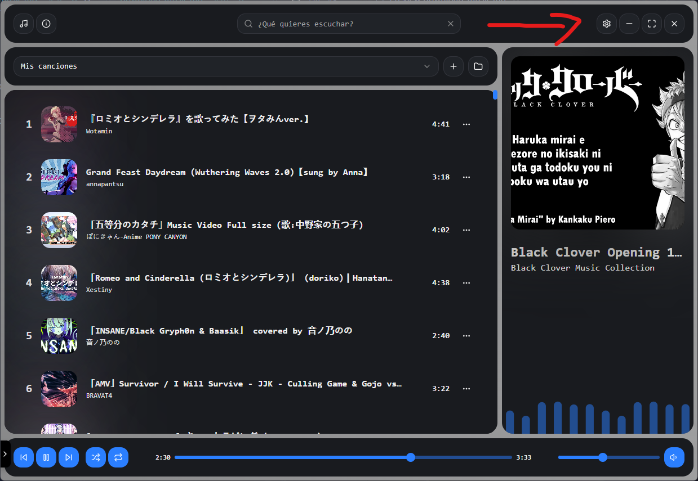
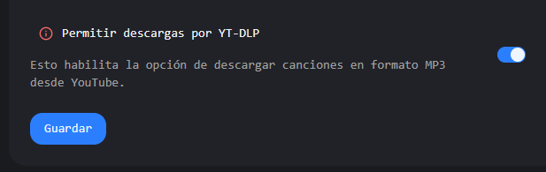
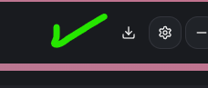
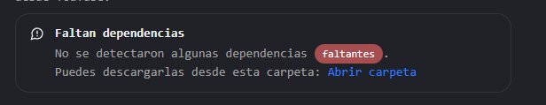
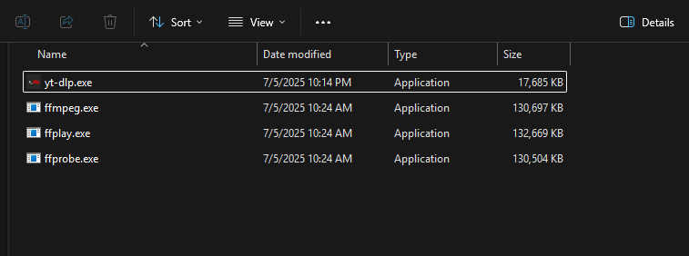
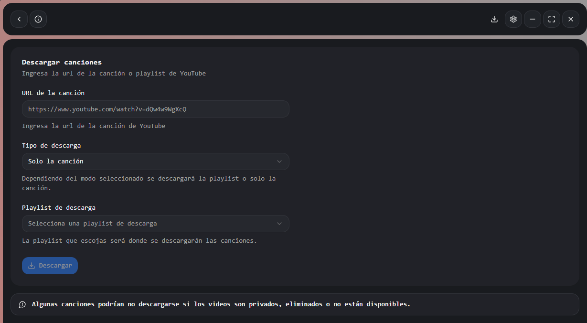

# 🎵 Descargar música

Para descargar música, por favor siga los siguientes pasos:

---

### 1. Ir a la sección de configuración

Haz clic en el icono de `Configuración` en la parte superior derecha.

---

### 2. Activar descargas con YT-DLP

Dentro de configuración, activa la opción `Permitir descargas por YT-DLP` y presiona `Guardar`.

> ✅ Si lo hiciste correctamente, verás un icono de descarga en la parte superior, junto a los controles de la ventana:

---

### 3. Instalar dependencias

Verás una advertencia en configuración indicando que faltan dependencias.

Haz clic en el botón `Abrir carpeta` para acceder al directorio donde deben colocarse las dependencias.

---

### 4. Descargar las dependencias necesarias

Debes descargar dos archivos:

- [yt-dlp.exe](https://github.com/yt-dlp/yt-dlp/releases)
- [ffmpeg.exe](https://github.com/yt-dlp/FFmpeg-Builds/releases)  
  _(Esto descargará un .zip con varios archivos. Solo necesitas `ffmpeg.exe`)_

Una vez descargados, mueve ambos archivos a la carpeta que abriste en el paso anterior.

> 💡 En la imagen hay 4 archivos, pero tú solo necesitas `yt-dlp.exe` y `ffmpeg.exe`.

---

### 5. Comenzar a descargar música

Ahora dirígete a la sección de `Descargas`. Debería verse algo así:

---

# ✅ ¡Todo listo!

Ya puedes descargar música simplemente copiando el enlace de un video de YouTube.

- Si es una playlist, puedes elegir descargar solo una canción o toda la lista completa.

---

## ⚠️ Limitaciones

- Videos **privados** o **no disponibles** no se descargarán correctamente.
- Solo se podrán descargar **playlists públicas** (accesibles por cualquier usuario).
- **Playlists privadas o personalizadas** en tu cuenta no serán detectadas.
- El contenido protegido o restringido tampoco podrá descargarse.
